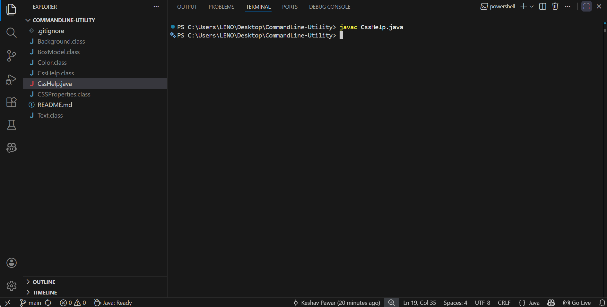
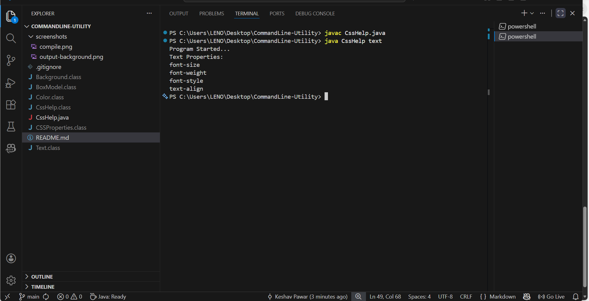

# CSS Help – Command Line Utility

# Description

CSS Help is a Java-based command-line utility that helps users quickly view commonly used CSS properties based on a given topic.

The tool accepts a CSS topic as a command-line argument and displays related CSS properties.

# Features

- Command-line based utility
- Supports multiple CSS topics
- Input validation
- Clean and simple output
- Uses Java interfaces and polymorphism

# Supported Topics

- color
- background
- text
- boxmodel

# How to Compile

javac CssHelp.java

# How to Run

- java CssHelp color
- java CssHelp background
- java CssHelp text
- java CssHelp box

# Example Output

Color Properties
- color

# Technologies Used

- Java
- Command Line Interface (CLI)

### Compile

### Output - Background

### Output - Text
